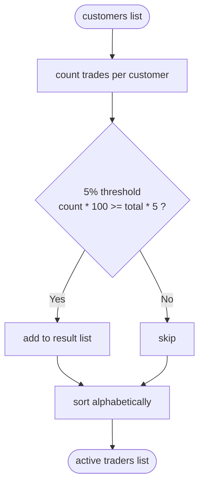
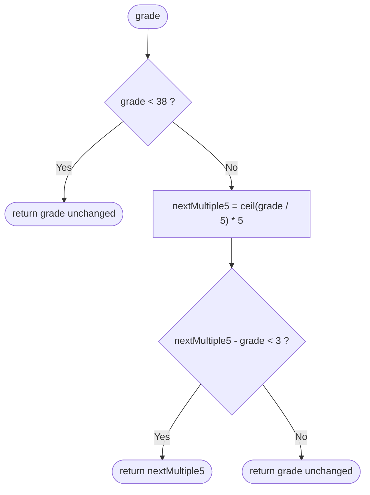
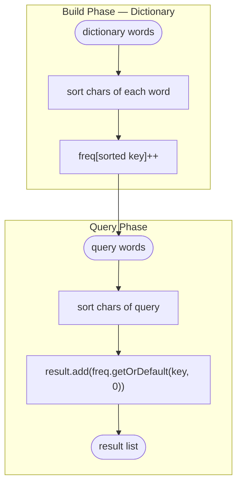

# HackerRank Problem Solutions

Solutions to HackerRank algorithm challenges implemented in Java, each as an independent Gradle project.

## Structure

```
solving_problems_hackerank/
├── active-traders/
│   ├── build.gradle
│   ├── settings.gradle
│   └── src/main/java/com/hackerrank/Solution.java
├── grading-students/
│   ├── build.gradle
│   ├── settings.gradle
│   └── src/main/java/com/hackerrank/Solution.java
└── string-anagram/
    ├── build.gradle
    ├── settings.gradle
    └── src/main/java/com/hackerrank/Solution.java
```

## Build & Run

Each project is independent. From any project folder:

```bash
gradle compileJava   # compile
gradle run           # run main
gradle jar           # generate JAR
```

---

## Problems

### 1. Active Traders

**Difficulty:** Easy | **Category:** Hash Maps

Find all customers whose number of trades represents **5% or more** of the total trade volume.

#### Logic

```
Input: list of customer names (one per trade)

Step 1 — Count frequency per customer:
  customers = [Bigcorp, Bigcorp, Acme, Bigcorp, Zork, Zork, Acme, ...]
  freq = { Bigcorp: 9, Acme: 5, Zork: 5, Littlecorp: 1, Nadircorp: 1 }

Step 2 — Apply 5% threshold (avoid decimals: count * 100 >= total * 5):
  total = 23
  Bigcorp:   9 * 100 = 900  >= 23 * 5 = 115  ✅
  Acme:      5 * 100 = 500  >= 115            ✅
  Zork:      5 * 100 = 500  >= 115            ✅
  Littlecorp: 1 * 100 = 100 < 115             ❌
  Nadircorp:  1 * 100 = 100 < 115             ❌

Step 3 — Sort alphabetically:
  Output: [Acme, Bigcorp, Zork]
```

#### Flowchart



#### Example

| Customer    | Trades | % of total (23) | Active? |
|-------------|--------|-----------------|---------|
| Bigcorp     | 9      | 39.1%           | ✅      |
| Acme        | 5      | 21.7%           | ✅      |
| Zork        | 5      | 21.7%           | ✅      |
| Littlecorp  | 1      | 4.3%            | ❌      |
| Nadircorp   | 1      | 4.3%            | ❌      |

---

### 2. Grading Students

**Difficulty:** Easy | **Category:** Math / Conditionals

HackerRank rounds student grades following two rules:
- Grades **below 38** are never rounded (still failing).
- A grade is rounded up to the **next multiple of 5** if the difference is **less than 3**.

#### Rounding Decision Tree

```
grade < 38?
    │
    ├─ YES → return grade as-is  (e.g. 29 → 29)
    │
    └─ NO  → nextMultiple5 = ceil(grade / 5) * 5
                 │
                 ├─ (nextMultiple5 - grade) < 3?
                 │       │
                 │       ├─ YES → return nextMultiple5  (e.g. 84 → 85)
                 │       │
                 │       └─ NO  → return grade as-is   (e.g. 57 → 57)
```

#### Flowchart



#### Examples

| Input | Next multiple of 5 | Difference | Output |
|-------|--------------------|------------|--------|
| 84    | 85                 | 1 → < 3    | **85** |
| 29    | —                  | below 38   | **29** |
| 57    | 60                 | 3 → not < 3| **57** |
| 73    | 75                 | 2 → < 3    | **75** |
| 38    | 40                 | 2 → < 3    | **40** |

---

### 3. String Anagram

**Difficulty:** Medium | **Category:** Hash Maps / Sorting

Given a `dictionary` and a list of `query` words, for each query find **how many words in the dictionary are anagrams of it**.

#### Strategy — Sorted Key

Two words are anagrams if and only if their sorted characters are equal.

```
Word sorting (canonical key):
  "listen"  → sort → "eilnst"
  "silent"  → sort → "eilnst"   ← same key → anagram ✅
  "lisent"  → sort → "eilnst"   ← same key → anagram ✅
  "cold"    → sort → "cdlo"
  "clod"    → sort → "cdlo"     ← same key → anagram ✅
  "two"     → sort → "otw"
  "tow"     → sort → "otw"      ← same key → anagram ✅
```

#### Flow

```
dictionary = ["heater", "cold", "clod", "reheat", "docl"]

Step 1 — Build frequency map of sorted keys:
  "heater" → "aeeht r" → freq["aeehrt"] = 1
  "cold"   → "cdlo"    → freq["cdlo"]   = 1
  "clod"   → "cdlo"    → freq["cdlo"]   = 2
  "reheat" → "aeehrt"  → freq["aeehrt"] = 2
  "docl"   → "cdlo"    → freq["cdlo"]   = 3

Step 2 — For each query, sort and look up:
  query "codl"   → "cdlo"   → freq["cdlo"]   = 3
  query "heater" → "aeehrt" → freq["aeehrt"] = 2
  query "abcd"   → "abcd"   → freq["abcd"]   = 0

Output: [3, 2, 0]
```

#### Flowchart



#### Complexity

| Step            | Time       | Space  |
|-----------------|------------|--------|
| Build freq map  | O(d · k·log k) | O(d) |
| Answer queries  | O(q · k·log k) | O(1) |

> `d` = dictionary size, `q` = query count, `k` = average word length
